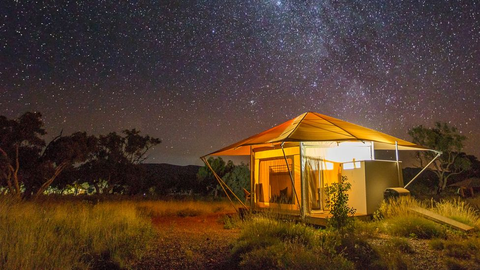

## 05-16:

今天阅读一篇文章：https://blogs.scientificamerican.com/guest-blog/programming-as-a-way-of-thinking/

**Programming as a Way of Thinking**
	The power of modern programming languages is that they are expressive, readable, **concise(简明)**, **precise（精确）**, and executable.

​	Programming has changed. In first generation languages like FORTRAN and C, the **burden（责任、义务）** was on programmers to translate high-level concepts into code. With modern programming languages—I’ll use Python as an example—we use functions, objects, modules, and libraries to extend the language, and that **doesn’t just（不只是）** make programs better, it changes what programming is.

​	Programming used to be about translation: expressing ideas in natural language, working with them in math notation, then writing flowcharts and **pseudocode（伪代码）**, and finally writing a program. Translation was necessary because each language offers different capabilities. Natural language is expressive and readable, pseudocode is more precise, math notation is concise, and code is executable.

​	But the price of translation is that we are limited to the subset of ideas we can express effectively in each language. Some ideas that are easy to express computationally are awkward to write in math notation, and the symbolic manipulations we do in math are impossible in most programming languages.

​	The power of modern programming languages is that they are expressive, readable, concise, precise, and executable. That means we can eliminate middleman languages and use one language to explore, learn, teach, and think.

​	As an example, Figure 1 shows the breadth first search (BFS) algorithm expressed in the pseudocode used in a popular textbook. The authors designed this language to be more concise and readable than most programming languages at the time, which was 1989.

​	Figure 2 shows the same algorithm in Python. It is a few lines shorter than the pseudocode, and because it uses more words than symbols, I think it’s more readable. Also, unlike pseudocode, we can run it, display the results, and debug it.

​	**Running programs is the whole point of programming, of course, but there is more to it. The ability to execute code makes programming a tool for thinking and exploring. When we express ideas as programs, we make them testable; when we debug programs, we are also debugging our brains.**

​	Languages like Python are also ideal for learning and teaching. For example, I wrote a book recently about digital signal processing (DSP). I used Python to write a simple library and Jupyter (which is a software development environment) to **compose（组成）** online notebooks that combine text, code, and results, including images and sound clips.

​	As I developed the book, I wrote code to test my understanding and explain it to students at the same time. Students can run the code to develop a mental model, make changes to test their predictions, and extend my code for their projects.

​	Most textbooks and classes use math to teach signal processing, with students working primarily with paper and pencil. With this approach, the only option is to go “bottom up”, starting with the arithmetic of complex numbers, which is not the most exciting topic, and taking weeks and many pages to get to relevant applications.

​	With a computational approach, we can go “top down”, starting with libraries that implement the most important algorithms, like Fast Fourier Transform. Students can use the algorithms first and learn how they work later. They can see the most important ideas, like spectral decomposition, without being blinded by details. They can work on real applications, on the first day, that provide the motivation to go deeper. And they can have a lot more fun.To demonstrate, I wrote a Jupyter notebook called “Cacophony for the whole family.” If you click that link, you can see the code and listen to the examples. It uses the library I wrote to simulate the sound of a grade school band, with instruments out of tune and some children randomly playing the wrong note. It’s meant to be silly (and a little bit mean), but it also demonstrates aspects of how we perceive sound and **interpret（解释）** the pitch of a complex signal.

​	The languages I am calling modern are not particularly new; in fact, Python is more than 25 years old. But they are not yet widely taught in high schools and colleges. And even where they are adopted, they are often used in a style that does not take advantage of their power.

​	Modern programming languages are qualitatively different from their predecessors, but we are only beginning to realize the implications of that difference.

## 05-17:

（今天是BBC的一篇新闻，请忽略新闻的真实性）

**McDonald's has said it will permanently（永久的） leave Russia after more than 30 years and has started to sell its restaurants.**

​	The move comes after it temporarily closed its 850 outlets in March.The fast food **giant（巨大、巨头）** said it made the decision because of the "**humanitarian（人道主义）** crisis" and "unpredictable operating environment" caused by the Ukraine war.

​	The opening of McDonald's first restaurant in Moscow in 1990 came to **symbolise（象征）** a **thaw（融化）** in Cold War tensions.

​	A year later, the Soviet Union **collapsed（倒塌、奔溃）** and Russia opened up its economy to companies from the West. More than three decades later, however, it is one of a growing number of corporations **pulling out（拔出、退出）**.

​	"This is a **complicated（复杂）** issue that's without precedent and with **profound consequences（深远的结果）**," said McDonald's chief executive Chris Kempczinski in a message to staff and suppliers.Some might argue that providing access to food and continuing to employ tens of thousands of ordinary citizens, is surely the right thing to do," he added. "But it is impossible to ignore the humanitarian crisis caused by the war in Ukraine. And it is impossible to imagine the Golden Arches **representing（代表）** the same hope and promise that led us to enter the Russian market 32 years ago."

​	McDonald’s, Coca-Cola, Starbucks **halt（停止）** Russia sales，McDonald's and Coca-Cola **boycott（抵制）** **calls（呼声）** grow
McDonald's said it would sell all its sites to a local buyer and would begin the process of "de-arching" the restaurants which involves removing its name, branding and menu. It will retain its **trademarks（商标）** in Russia.

​	The chain said its **priorities（优先）** included **seeking（寻求）** to ensure its 62,000 employees in Russia continued to be paid until any sale was completed and that they had "future employment with any **potential（潜在）** buyer".

​	McDonald's said it would write off a charge of up to $1.4bn (£1.1bn) to cover the exit from its investment.

​	It really is the end of an era. I was in the queue when the first Russian McDonald's opened on Moscow's Pushkin Square in January 1990 - way back in the USSR.

​	There were so many people outside the restaurant, it took three hours to get inside. But what a sense of excitement.Those American burgers, fries and pies were a symbol of Moscow embracing the West. Hot food to help end a Cold War.

​	These are very different times. Russia and the West have lost their **appetite（胃口）** for one another.Russia's attack on Ukraine has sparked international condemnation and **sanctions（制裁）**, turning Moscow into a **pariah（贱民）**.

​	Meanwhile, the Kremlin - as it always does - points the finger back, accusing the West of **plotting（密谋）** Russia's downfall.

​	Back in March lots of international companies announced they were pausing operations in Russia, hoping the situation would resolve itself and they could then reopen.

​	But McDonald's decision to sell up and pull out shows the fast food giant recognises things will not return to normal and that what the Kremlin calls its "special military operation" in Ukraine has changed things long term.

​	Big Macs are only the beginning. I predict we're going to see a lot more global brands leaving Russia.

## 05-18:

(今天内容来自BBC，请忽略真实性）

**Shanghai lockdown: The hard life of a homeless deliveryman**

​	Weeks into a strict **lockdown（封锁）**, most of Shanghai's 25 million population continue to rely on delivery **riders（骑手）** to bring them food and supplies. But this largely **invisible（不可见、忽略）** workforce of 20,000 faces a lack of **shelter（庇护、居所）** and safety. Two delivery riders tell the BBC their stories.

​	I've been so busy. So many people need supplies. I make deliveries all day long, then when it's approaching midnight, I look for a place to sleep.

​	I left my apartment on 8 April and haven't been back since. The Shanghai government allows delivery riders to leave and enter their residential **compounds（大院）**. But the compounds insist on enforcing their own policies, and most don't allow riders to return to their own homes. There are hotels that are open, but not many are open to us.

​	There was a tent in front of my compound. You know, those blue ones set up for Covid testing. When I left home, the compound managers asked me to help them buy supplies and in exchange they offered me the blue tent to sleep at night. I left all my stuff in there.

​	But one day the tent was gone. I couldn't find my stuff. The managers said it wasn't their business. Security guards there said they didn't know where my stuff went.

​	So I had to look for a new place to sleep. Sleeping under a bridge just comes naturally to us delivery riders - it can block out the wind and rain. I usually fall asleep immediately after lying down - I feel so tired by then!

​	One day I forgot to pay attention to the weather forecast. It was raining heavily and all the space under the bridge had been taken. I found an ATM room to sleep. It was quite a good place, no-one else was around. My only hope was that the police wouldn't **show up（出现）** and kick me out.

​	But after two nights there, around 2am, policemen on **patrol（巡逻）** saw me and **chased（追捕）** me away. They said I should go to a homeless shelter. But I've tried and it's not open. Nobody was there, not even security guards.

​	In the beginning I survived on dry instant noodles. Later a group of delivery riders found a restaurant that opened secretly and now we go there to buy **takeaways（外卖）**. The police usually just ignore it. We do need a place to eat, right? Some shops also have an outdoor space where there are electrical sockets. We **sneak（悄悄）** over to charge our phones.

​	There was a story going round that a delivery rider died on the streets after getting into a crash. Of course I worry that will happen to me too. But I've been very careful. I always go very slow. If I get into an accident in a remote area, it would be extremely dangerous. The biggest problem is if your **scooter（电瓶车）** breaks down and there is no place to fix it. You can't work any more.

​	Many people saw news reports saying delivery riders can earn up to 10,000 yuan per day ($1,500; £1,200). Since then many have asked me how to become one. My advice is usually: "Don't become a rider."

​	In Shanghai, the pay we earn as riders is quite all right. But most riders only earn a few hundred yuan a day. And I don't think everyone can **put up（提供）** with such hardship, such living and working conditions.

​	But you know, if we weren't doing this, we wouldn't have any income either while under lockdown. That's stressful.

​	I was born in 1999 in Anhui province. When I graduated from high school, I couldn't get into a good university. The **tuition（学费）** fees were too expensive for my family. I was so young and had no idea what I could do. My mum suggested I join my cousin in Shanghai. At least I wouldn't be left with no place to sleep and no food to eat.

​	So I came to Shanghai and worked with my cousin to sell computers. That lasted about two years. Business went down during Covid so I started to look for a new job. I had no place to live back then. I found a shared rental with another rider. It seemed like he was earning a lot. I said: "Brother, could you help me become a rider, too?" So about half a year ago I became one.

​	People told me Shanghai is a developed city, better than my hometown. Now even my family is asking me to go home. They've all heard about the situation here. It's unimaginable that people can starve in Shanghai nowadays.

​	But it's not like I'm starving or anything. I'm from the countryside, I slept in a cowshed when I was a child. I'll be fine.

​	I used to earn on average 4.5 yuan per order. But I don't take these orders anymore, nobody does, it's too low. These days I take orders privately from my clients, through **chat groups（群组）**. I can earn around 1,000 yuan a day.

​	I see larger residential compounds doing group buys of food, but smaller compounds with just a **dozen（一打）** residents have nothing. It's so hard to get people to deliver things to them, it's also hard to order supplies in the first place. Many elderly people also don't know how to do group buys.

​	Orders with small quantities of food won't get delivered now. Fruit shops won't sell individual pieces of fruit any more - you have to buy in bulk now. If someone wants 20 yuan worth of vegetables, I'll end up spending half a day looking for that and get nothing, as only bulk vegetable packages are available and each costs over 100 yuan.

​	Now we have no food and no water, and sleep on the streets. I know at least 40 riders in the same situation as me. There are delivery riders who work for companies which provide hotel rooms for them. But there are those who take online orders from customers, like us, and the local government has done nothing to help us find a place to stay.

​	My residential compound won't let me back in, they say it's likely I'll bring the virus back. I can't go home even if I test negative for Covid. I've been going to hospitals to get tested every day. I'm afraid of getting Covid - all the riders are afraid of it.

​	So I just find a place to sleep outside. My feet **stink（恶臭）** so bad you can smell them from a distance! I'll shower eventually, maybe after the lockdown lifts.

​	What's the point of resting at home anyway? The first week of the lockdown, I only got two cabbages. The second week I only received a box of medicine. Who can survive on that? What do I eat? It's better to be outside - at least I can still find some food.

​	Delivering food is better than working in a factory. I've worked in a few in Shenzhen, earning only 200 yuan per day, working 12 hours a day. Delivery riders have better income and more freedom. How much you earn depends on how much effort you put in.

​	My family has been asking me to come back. But how can I get out now? People even got chased back into the city after driving out to the highway.

​	I'm just waiting for the lockdown to be lifted. I'll leave then. I don't know how much longer I can **hold on（坚持）** for.

I'm so done with Shanghai. Once I leave, I'll never come back.

## 05-19:

(今天内容来自BBC，请忽略真实性）

**Australia election: How climate is making Australia more unliveable**

​	"It's **devastating(毁灭)**. The amount of time and effort you put in your home and then to see it go under water." Sam Bowstead is an **architect（建筑）** who specialises in preparing houses to **withstand（承受）** natural disasters. But when floods **engulfed（吞没）** his Brisbane home in February, he felt helpless.

​	"I've worked with people who've been in similar situations - now this happened to me," he says.

​	"I was shocked at how fast [the water] rose... more than a metre in a couple of hours. I went from being worried about our property to being worried about our safety." In the end, a boat was the only way out.

​	Mr Bowstead's experience has become increasingly common for Australians. In the past three years, record-breaking bushfire and flood events have killed more than 500 people and billions of animals. **Drought（干旱）**, **cyclones（旋风）** and **freak（反常的）** **tides（潮汐）** have **gripped（夹住）** communities.

​	Climate change is a key concern for voters in Australia's election on Saturday. So is the cost of living - and these issues are **converging（汇聚）** like never before.

​	Australia is facing an "insurability crisis" with one in 25 homes on track to be effectively uninsurable by 2030, according to a Climate Council report. Another one in 11 are at risk of being underinsured. Insurance for the highest-risk homes will be **prohibitively（禁止、过高）** expensive or refused by providers, says the Climate Council, which created an interactive map for Australians to search.

​	"Climate change is playing out in real time here and many Australians now find it impossible to insure their homes and businesses," says chief executive Amanda McKenzie.

​	The state most exposed Nowhere is this a bigger issue than in Queensland. It is home to almost 40% of the 500,000 homes projected to be effectively uninsurable. Queensland has been **ravaged（毁坏）** by floods in recent months. In February, the state capital Brisbane had more than 70% of its average yearly rainfall in just three days.

​	"I still feel quite **traumatised（受创伤的）** when it rains heavily," says Michelle Vine, whose East Brisbane home was destroyed along with decades of her artwork. "We had to move out of the home - it became unliveable."

​	Insurers say the floods - which also **battered（重创）** New South Wales - will become Australia's most expensive flood event ever. But even before this year, insurance costs were skyrocketing. Though rising property prices are one factor, Australia's peak insurance industry body points the finger at climate change. The Insurance Council of Australia says no parts of the country are currently uninsurable but there are "clearly affordability and availability concerns".

​	Over the past decade, the amount paid out by insurers on damage claims from natural disasters has roughly doubled.On average, consumers now pay almost four times for home insurance premiums than in 2004. In northern Australia, these numbers are even more extreme - in some cases 10 times higher than elsewhere. More Australians are being forced to underinsure - purchase cheaper policies that cover too little - or forgo insurance altogether.

​	"This is probably Australia's most important cost-of-living issue," Dr Antonia Settle, a political economist at the University of Melbourne, tells the BBC. "Households that don't have insurance risk losing their most important asset."

​	The phenomenon could also **exacerbate（使恶化）** social inequality and create "climate ghettos", says Climate Valuation, a risk analysis company. Properties in higher-risk areas are becoming cheaper to buy and rent, often attracting people who are least able to afford adequate insurance, compounding the financial impact of disasters.

​	"People are not moving away from climate-endangered places in Australia. And in fact, along the fringes of the major cities, they are more likely to move toward them," says demographer Liz Allen from the Australian National University. "The housing affordability issue in Australia is so **dire（可怕）**… that people see climate **catastrophe（灾难）** as almost a bargain, a way to ensure that they can have a place to call their own."

​	Ms Vine is one example of this - saying she was drawn to a **vulnerable（脆弱的）** area by price. At the time, she felt like she'd "won the lottery". Mr Bowstead made a similar choice, describing it as "a Catch-22... for young people". And once in a risky area, it's near impossible for many to get out - as is the case for Gary Godley in the town of Grantham, west of Brisbane. Given Grantham's horrific flood history - 12 people died there in 2011 - there are no takers for his home. "We want out. We just can't afford it," Mr Godley says. "We can't do anything."

​	The government has promised billions to help "reinsure" insurers against major claims resulting from disasters, arguing it will essentially halve **premiums（保险费）** for people in northern Australia. But it is a risky policy, and not one either the Insurance Council of Australia or the country's industry **watchdog（监察）** wanted. Critics have pointed out that disasters are now frequently devastating areas outside northern Australia that won't be covered by the policy. What about their premiums?

​	They're instead calling for the government to limit development in high-risk areas, consider buying out some homeowners, or create **incentives（激励）** for people to make their properties disaster-**resilient（有弹性的）**. But the obvious answer is addressing climate change, Dr Settle says - though this is something successive governments have been reluctant to do.

​	After massive bushfires in 2019-20, Australians were warned to prepare for an "alarming" future of simultaneous and worsening disasters. Yet for a nation so exposed to climate change, Australia remains one of the world's biggest **emitters（排放）** per head of population. Prime Minister Scott Morrison's government has promised to reduce emissions by 26% by 2030. Labor, under Anthony Albanese, has pledged a 43% cut. Both are below the 50% recommended by the Intergovernmental **Panel（专家组）** on Climate Change.

​	Most Australians want **tougher（艰苦的）** climate action, but both parties have kept **fairly（相当的）** quiet on the topic during this election campaign. In the town of Gladstone - which lies in a marginal seat in central Queensland - the reason for this avoidance is clear. Coal is an **integral（必须的）** part of Gladstone. It's shipped from the local port and has helped Australia become the second-largest exporter globally and created thousands of jobs. Phil Golby, a local Australian Manufacturing Workers' Union official, says "change is inevitable" but fears fossil fuel workers will be left behind.

​	"I've heard a lot of talk. I've listened to a lot of presentations - but I haven't really seen a direct path yet," Mr Golby says. "If a new industry comes [to Gladstone] we need to make sure that we're going to get our workforce trained… [and] it's got to replace their pay. We can't start to see people going backwards."

​	Essentially, coal lies in that impossible place between Australia's **prosperity（繁荣）**, politics, and environmental **perils（事故）**. So **phasing out（逐步淘汰）** fossil fuels is a politically toxic issue that no big party wants to tackle head-on, especially not during an election. That frustrates Mr Bowstead. For him and so many young people there's a real anxiety about what climate change will mean for how and where they'll live in the future. "[It's] not going to happen - this is happening already," he says. "It feels like we're going to have to take responsibility and bear the **brunt（冲击力）** of that for much longer than most of those people who are in power now."

## 05-20:

​	

**Dating to around 3.6 billion years ago, the Pilbara region of Western Australia is home to the fossilised evidence of the Earth's oldest lifeforms.**

​	In recent years, science has confirmed what **Aboriginal(本土的)** Australians, the world's oldest continuous living culture, always knew: the Pilbara region of Western Australia is among the oldest places on Earth.The Pilbara began to form more than 3.6 billion years ago and its vast landscape of deep pindan reds and endless **panoramas（概览，全景）**, which stretches from the west coast to the Northern **Territory（领土）** border, is an ancient, forbidding place. For those travelling to the region for the first time, the initial sense of space and **solitude（孤独、独处）** can be **daunting（令人畏惧的）**: it's roughly double the size of Great Britain, but with a population of just 61,000, it is one of the most **sparsely（稀疏的）** populated regions on Earth.

**The world's most ancient crust(地壳)**

​	Scientists have determined that the Pilbara's vast **formations（形成）** of iron-rich rock, formed prior to the existence of oxygen and life itself, is [the best-preserved example of the world's most ancient crust](https://www.nature.com/articles/s41561-018-0105-9). While other global iron **deposits（沉积、存款）** are thought to have formed at a similar time, the surface of the Pilbara remains unburied and **undisturbed（未被打扰的）** by geologically cataclysmic events.

​	"The unique thing about the Pilbara landscape is not just its age, but its incredible state of preservation," said Martin Van Kranendonk, professor of geology at The University of New South Wales, who has spent years mapping and studying the Pilbara.

**The Earth's oldest lifeforms**

​	According to Van Kranendonk, Pilbara rock is so ancient that it contains no fossils within its structure, yet **stromatolites（叠层石）**, the fossilised evidence of the Earth's oldest lifeforms, are found upon it.

​	In 1980, 3.45-billion-year-old fossil stromatolites were found near Marble Bar (pictured above) in the Pilbara. These **microbial（微生物）** **cyanobacteria（蓝藻）** communities first existed when conditions on Earth could not support any other form of life, building **bulbous（球状）** reef-like structures as they released oxygen through **photosynthesis（光合作用）**.

​	Incredibly, just south of the Pilbara at Hamlin Pool near Shark Bay, [the world's most extensive living stromatolites system is still thriving](https://www.bbc.com/travel/article/20210117-stromatolites-the-earths-oldest-living-lifeforms), even fizzing, as it produces oxygen in the **hypersaline（超盐性的）** bay. This is one of just two places on Earth where living **marine（海洋的）** stromatolites exist.

**Exploring the** **Red Planet（行星）**

​	In 2019, Nasa scientists **conducted（管理、分析）** investigations in the Pilbara with Van Kranendonk to better prepare them for their [journey to Mars](https://www.nasa.gov/content/nasas-journey-to-mars/). "Many of them had never personally seen evidence of ancient life and that's what they were going to Mars to look for," said Van Kranendonk. "So, for them, it was really an eye-opening experience, to see and understand the details and **texture（纹理）** of the fossilised stromatolites to get a better understanding of what signatures to look for as they search the surface of Mars for evidence of life."

​	More than just its age, the chemical similarities of the rock **composition（组成）** mean the Pilbara is highly relevant to the scientists' preparation for the Mars mission. "The composition of those rocks and the amount of iron in the Pilbara is amazing and similar to Mars," said Van Kranendonk, "which is why it is known as the Red Planet."

**An underground surprise**

​	The Pilbara can be unforgiving, extreme and sometimes dangerous for the ill-prepared. It is also **hauntingly（难以忘怀）** beautiful and **captures（捕获）** the imagination of visitors from around the world.

​	Although the area looks like semi-arid desert, within it is one of the world's most beautiful national parks. **Carved（雕刻）** out of the land by billions of years of slow **erosion（腐蚀）**, [Karijini National Park](https://parks.dpaw.wa.gov.au/park/karijini)'s **otherworldly（超凡脱俗）** **splendour(壮丽)** lies deep in its ancient **gorges（峡谷）** and sheer-sided chasms, where dramatic waterfalls and **crystal-clear（晶莹剔透）** waterholes are set among the striated rock.

​	For visitors, this is a **paradise（天堂）** of cool rock pools fed by underground springs, **lush（茂盛）** vegetation and abundant wildlife. For scientists, the **canyons（峡谷）** at Karijini offer **unparalleled（无与伦比）** access to naturally **excavated（发觉）** cross **sections（截面）** of layered rock that **reveal（揭示）** much about the Earth at the time this ancient land was formed. "It is such a beautiful thing; those gorges allow you to look down through the layers of time," said Van Kranendonk.

**A natural spa pool**

​	The **permanent（永久的）** flowing waterfalls, waterholes and **oases（绿洲）** found here are made only more **awe-inspiring（令人敬畏）** given the conditions on the **harsh（恶劣）** Pilbara **exterior（外部的）**.

​	Like an ancient, secret **cistern（水池）**, Spa Pool has been hewn from the rock by the constant flow of water at the head of Hamersley Gorge. The bath-like formation is almost completely **enveloped（包围）** in **multi-hued（多色调的）**, smooth rock wall. The gentle **burbling（潺潺水声）** of the stream constantly **replenishing（补充）** the pool is the only sound in one of Karjini's most **intimate（隐私的）** **hideaways（潜伏处）**.

**Australia's hidden secret**

​	The only **accommodation（住宿）** in the national park is the **indigenous（本土的）**-owned [Karijini Eco Retreat](https://www.karijiniecoretreat.com.au/). Early mornings at the retreat are special. The cool, **predawn（黎明）** air is energising, and the low light filtered through **suspended（悬挂）** iron-rich **dust（沙尘）** **saturates（浸透）** the landscape in colour before the full sun of the late morning washes away this **intensity（强烈）** until sunset.

​	At night, when there is a confluence of clear skies and no moon, Karijini is a dark sky **wonderland（仙境）** for **stargazers（占星师）** and astro-photographers alike. The dry air and lack of light pollution provide for a dazzling display of detail in the **Milky Way（银河系）.**

​	"Karijini is a unique and **iconic（象征性的）** Australian destination," said co-owner Marnie Shields, explaining that guests are often overcome by the beauty, accessibility and diversity of Karijini. "While the **magnificent（壮丽）** region is being revealed to the rest of the world, it's still one of Australia's most spectacular hidden secrets."

**A shocking world of contrasts**

​	According to Karijini guide Pete West, the **stark（荒凉、鲜明）** shift in microclimate, **fauna（动物群）** and **flora（植物群）** shocks most visitors as they descend from the **arid（干旱）** surface into the **lush（茂盛）**, **verdant（翠绿的）** gorges.

​	"It becomes apparent very quickly that there's a distinct micro-environment in the gorges," he said. "The flora is remarkably different from the surface, like **melaleucas（乔木）**, which are the biggest trees in the Pilbara. You just don't get it on the surface, you only ever see them in **creek（小溪）** beds. Then there [are] the **delicate（精巧）** **ferns（蕨类植物）**, **moss（苔藓）** and the big leaf **fig（无花果）** tree (pictured above). It's such a **contrast（差异）**, in and out of the gorge."

​	The **presence（出席）** of permanent water in the gorges is the fundamental building block of the gorge microenvironment that supports fish, flying foxes and a range of **predators（捕食者）** taking advantage of the optimal conditions. The abundance of **reptiles（爬行动物）** is **astounding（令人震惊）**, from small desert dragons to pythons up to 5m in length.

**Important women's place**

​	Karijini is also a place of important cultural significance to indigenous people, with certain locations in the park recognised as women's-only places and others that are strictly for men. "There are places, for instance, women would go if they wanted to get pregnant and places they would visit if they wanted to have twins," explained **anthropologist（人类学家）** Dr Amanda Harris, who has worked across the Pilbara with traditional owners.

​	Fern Pool (pictured above), located in a **terrarium玻璃容器（）**-like environment at the genesis of Karijijni's Dale's Gorge, is an important women's place to the local Banjima people, yet unlike other indigenous destinations that prohibit **interference（干预）**, such as [Uluru's climbing ban](https://www.bbc.com/news/world-australia-50151344) and a prohibition on photography at areas within the Kunku-Breakaways near [Coober Pedy](https://www.bbc.com/travel/article/20191121-australias-subterranean-oasis), Karijini traditional owners welcome all guests, asking only that visitors be respectful and walk lightly.

**A place of respite**

​	Scientists believe that the Banjima people and their **forebears（祖先）** have been using Karijini, which means "hilly place" in local Aboriginal languages, as a meeting location for 30,000 to 40,000 years. **Nomadic（游牧）** **tribes（部落）** of the Pilbara maintained life in a challenging environment with daily resource gathering essential for survival. Karijini offered a place of **respite（休息、暂缓）** and security of resources, shelter and permanent water.

​	"Karijini is referred to by all the neighbouring tribes as a meeting place, as an ancient place where business is conducted, families get together, marriages are arranged, **lore is passed（传说传递）**. This still goes on today," said West.

​	Mount Bruce (pictured above), Western Australia's second-tallest peak, stands at the entry to Karijini and holds both geological and indigenous significance. Known as Punurrunha to indigenous people, the mountain is a **sacred（神圣的）** site and highly significant in Aboriginal Law. To Banjima, this is strictly a male-only site, with some female elders refusing to even set eyes on the peak as they pass by. Visitors, however, are not restricted from photographing or even ascending to the summit.

**Ancestral knowledge**

​	The Pilbara is still revealing new secrets about early conditions on Earth and the life of the region's first **inhabitants（居民）**. While new discoveries about how long the Pilbara has been continuously inhabited surprise scientists, to indigenous people, it is something they have always known.

​	"Because we know life, as a people we've always known [human] life started here," said Yindjibarndi and Ngarluma elder and indigenous Pilbara tour guide Clinton Walker. "The world began here, everything began here. So, from our **perspective（角度）**, we've never believed we came from anywhere else except here and that we were created in this landscape by beings much more advanced than us, who also taught us all our knowledge."

**Records of extinct（灭绝） macropods**

​	Earlier this year, Walker was exploring at low **tide（潮汐）** and found ancient rock **etchings（刻画）** that **depict（描绘）** **kangaroo（袋鼠）** footprints in the **intertidal（潮间带）** zone of the Pilbara's Burrup Peninsula. He believes this is [the first such underwater find of its kind anywhere in Australia](https://www.abc.net.au/news/2021-07-15/tour-guide-uncovers-underwater-rock-art/100294428), **garnering（获取）** significant scientific interest. He explained that the current theory of origin is that this etching was likely made after the last ice age when the water levels were more than 100m lower, between 7,000 and 18,000 years ago.

​	Walker delights in showing guests local rock art containing important imagery such as extinct macropods (pictured above) and believes that many discoveries, both underwater and on land, are yet to be made.

​	"It's so funny, even when I'm doing tours, I'll still find lots of new rock art at the same places I have been many times," said West. "But even the guests are finding things I haven't seen before either, you know. It's exciting for everyone."

**A magical place**

​	The magic of the Pilbara lies in its ancient roots. There are no crowds, fences, buildings or other impositions of modernity. Just a place as old as time and its **custodians（管理员）** that welcome you to make your own journey of discovery.

​	"This place is for seekers, you know. For photographers, for artists, for painters, geologists, lovers of nature," said West. "I see this in people that come to Karijini in particular. As you walk through those gorges, guaranteed you'll be running your hands along the oldest rocks you'll ever touch. When you think about this, our problems, our concerns, our ambitions are all almost **irrelevant（不相关的）**. It gives you a true sense of **perspective（透视感）**. I think that's super cool."

## 05-21:

​	I did 15 years in prison and when I got out it was like being on another planet. Everything had changed so much and it was so **overwhelming(难以抗拒)**, I couldn't even walk into a store or just be around everyday people without **panicking（恐慌）** and **sweating（出汗）**, words couldn't describe how I felt… I stayed at a men's shelter for 11 months and did any kind of work I could do. I got a car, got my own place and met a woman who changed my life. I'm a **plumber（水电工）**, but I had been gone so long and so much had changed that I was scared to get back into plumbing, plus I had 20 years **probation（缓刑）**. I was blessed to be given the greatest Probation Officer in the world, who after time had faith and believed in me. Don't get me wrong, when I screwed up and/or got too **cocky（骄傲）** she let me know who was in charge and hammered me!!  But I kept proving myself and she would give me a little more and a little more lead way which also built my confidence in myself. That's how a P.O. should act and treat you, especially as long as I had been down. I would not have or be in the situation that I'm blessed with if it wasn't for having the Probation Officer I was given…. Thank you Kimiko..

​	My P.O. gave me the ok to work at a plumbing Company and I was rusty as hell and felt stupid but I stuck with it. Plumbing prices had gone up 4 to 5 times higher from when I got put in prison and it blew my mind. I made. 40 cents an hour in prison and now I was making $20 an hour and I was in heaven. I kept giving people breaks on the jobs I did, especially the elderly and it wasn't going over good with the company and we butted heads over me doing this where I finally said that I think I can do better on my own and the owner laughed and said, “ Good luck “… They just thought I was a crazy old long hair and didn't know what I was talking about…

​	So I talked with my P.O. and she gave me the green light to start my company. I hit the ground running. I contacted the Contracting Board , took the written part of the test and had to go before a 6 member panel and prove to them **verbally（口头上的）** and with documentation that I had turned my life around, because I was a felon. So I spoke (and I can talk) for 45 minutes and… they **unanimously（全体一致）** agreed to give me my Plumbing License…Ha!!!😎😎😎 . Just another thing all the know- it-alls said that I wouldn't be able to get and/or do…I had built my credit up and got a $15,000 loan and started hitting up property management companies and started getting jobs and worked 12 to 14 hour days… that was 4 years ago and I haven't looked back!! I let all the companies that I work for and all my long time regular customers know that I was in prison. All the stories you heard from the guys who got out and came back saying, “nobody will hire you or you can't get a job”.. I don't believe it!!! People LOVE the underdog and come back stories, you might get a few who are ignorant, but for the most part people WANT to see you succeed and go out of their way to help you anyway they can….

​	I just bought my 3rd house , I have 2 guys working for me and the work just keeps coming in… i don't advertise, only the artwork on my van and business cards …word of mouth is the best. At my 5 year mark of being out I got a lawyer, petition the court to consider letting me off probation and the judge granted my **motion（运动）** and terminated the 15 years of probation I had left.. which rarely happens and guess who said THAT would never happen….the haters.…I was a drug addict and I was a hot mess and I wouldn't have any of this if it wasn't for my God and my **Sobriety（清醒）**. I promised my God, myself and my daughter that I would do everything I could not to be that person that I was, if he could just help me make it out of prison alive. God kept up his end of the bargain and I have been sober since the day they put **handcuffs（手铐）** on me on December 23rd 2000… And the woman I met… She married me and it will be 4 years this December of 2021 and I've never been so happy!!

​	I was released from prison June 12th, 2015….

​	The reason I've written this long ass post is to try and pass on …it CAN be done!!! Don't listen to the know-it-alls that got out and kept coming back inside saying how “you can't do this, or you can't do that”.. they didn't want to put the work in!!! I did EVERYTHING they all said that I wouldn't be able to do..I didn't write all this to **brag（吹牛）**, I wrote this to let y'all know your dreams can come true after you get out no matter what you did… go for it!

## **05-22:**

**[What is the saddest part of being a programmer?](https://www.quora.com/What-is-the-saddest-part-of-being-a-programmer)**

​	Really putting your all into a project and writing great code that you're proud of, creating innovative solutions, **getting some massive project off the ground(让一些大型项目落地)** and hearing how much of a game changer it is from users……and then you and half your team getting **laid off（被解雇）** because the board decided not to budget for you bc your big project is done and they want to make the numbers look better. I can never look at that code again and I'm **contractually（合约）** **obligated（有义务的）** to not carry it around with me and use it as a portfolio. I dedicated a year of my life to something that was **ripped（剥夺）** from me in a 5 minute meeting because some rich guy who doesnt have to worry about making a real living wanted a better return on an investment.This kind of stuff - knowing that no matter how much I put into something it's not mine and I can't claim my work as my own, even just to prove to other employers what I can do (since, when you work 60-80 hrs a week, there's not much time or energy left to create a portfolio of complete personal projects), and knowing most of the time ill never even have access to what I wrote…I dedicate my life to **phantoms（幻影）** of success. It's really killed my passion over the years.
