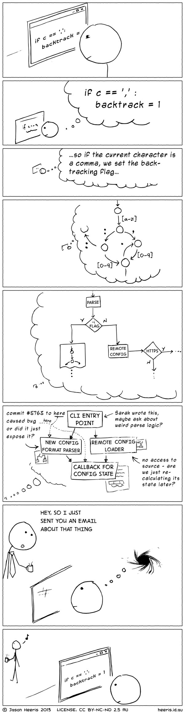

## 05-23:

今儿想Google下有Java的基础下，如何去学习Go,下面这个好像也没说啥，就当简单的阅读。

https://dev.to/rubyshiv/how-to-get-started-with-golang-as-a-java-developer-1icd

**How to Get Started with GoLang as a Java Developer**

​	For quite some time, I have wanted to learn GO. The programs that I used to read, appeared to be simple enough to understand.

​	As Java developers, we are quite used to lengthy syntaxes. We don’t forget the “;” and our file name and public classes have the same name. We also take care of the visibility and access modifiers even for a simple Hello World program.

​	I just started learning GO and find it much **relatable(有关系的)** to Java in terms of the package and import declaration and the method /function syntax. With no classes to define and semicolons to add, I find GO much quicker to develop, at least for a simple application like “Hello World”.

​	Let’s try to implement a simple Hello World program in GO using a text editor and a Code Editor.

**Step 1: First things first, let’s download and install Go on our local machine.**

​	 Installation steps for all the different OS’s are given in the official guide at https://go.dev/doc/install. I have installed the below-given version of golang, (use go version command to check that)

​	

**Step 2: Create the project structure**

​	A GO project must have 3 directories — bin, pkg, and src. Under the src folder, we will create our application folders and files.

bin folder stores all the binaries generated from the application and the downloaded dependencies. pkg is an **intermediate（中间产物）** folder that holds the compiled objects from src directory.

**Step 3: Create project folder under src**

​	All the code that’s part of our application will go under the src folder. Let’s create a folder under the src directory which will follow the naming **conventions（会议、惯例）** similar to the one we use in java applications — com/something/something.

​	In this article we are just creating a single package under the src package and named it main, it could be any other name as well. Create a file with *.go extension. The first thing in a go file must be the package declaration, followed by the imports under two simple brackets “(“ and “)”. Next, write the “main()” function that would use the fmt package to call “Println” function. “main()” function must be declared in the main package else the compiler would complain. Here’s the complete code to this hello world program

**Step 4 (Optional): Use a Code Editor**

​	I’m quite used to using STS and Eclipse for Java programming so at first, I tried to install the go plugin to STS and create a Hello World program. My experience with Go on STS/ Eclipse was really bad, now it could be because I don't know how to configure a Go project correctly on that IDE but overall the experience was not good and the error messages didn’t make it easy to figure out the root cause. So I did some research on the best tools to use with Go. Turns out there are more code editors than IDE as such and the best IDE is GoLand by JetBrains, the same folks who developed IntelliJ. A few of the popular code editors are vim, govim, and VS Code. I have never tried VS Code before and always wanted to try it so I decided to try VS Code for GO programming.

​	Firstly, I installed the go plugin for VS Code,Go Extension for VS CodeThen wrote the same program shared in Step 3, using the Terminal tab in VS Code, executed the GO program.

**Conclusion**
	I like the fact that GO is a simple language, especially coming from a Java background.**A hello world is not even the tip of the iceberg but it’s a start.** While learning human languages we tend to compare the new language to the one we already know, it makes learning easier through **comparison(比较)**. I’m trying to follow the same approach to see how to program the specific actions that I usually carry out using Java in GO.

## 05-24:

**Have you ever broken up with someone over a single character flaw?**
	Not me, but my bestfriend. We’ve known each other for 12 years, she’s probably the most beautiful, intelligent girl I’ve ever met, but somehow her love life is always **kinda(有点)** rough.

​	So she met this guy through a friend 2 years ago, **senior（大四）** year in college. She got an intern job in a huge company, while studying. She’s under a lot pressure, and this guy didn’t even show a little bit empathy, all he said to her was: ”quit your job, move to my hometown; we’ll live together with my mom and be a housewife.” They’ve only been dating for 2 months and that’s all he said. At first she thought he’s joking, but he said it to her over and over, he told my friend that’s his “big plan” for their future; he really meant it.

​	I know a lot girls want to be a house wife, to be taking care of their family 24/7, I respect that completely, but that should be based on your own will and with an equal and respectful partner. That **dude（家伙）** just took it for granted, he just naturally assumed every girl’s dream is to be married, have kids, do all the house work, so he can be “the man”. Since he didn’t show respect at all and wouldn’t shut up, my friend quickly broke with him, he didn’t even understand why and called her selfish. What a **jerk（急推、粗蠢）**.

​	2 years later, my friend has graduated with straight A grades, some savings, and last months she got an unconditional offer from The University of Sydney; she will be a graduated student next year March. I’m so proud of her.

## 05-25:

**Programmers, what's the funniest outsider's view of your job you've ever heard?**
	Many moons ago my ex wife was in the room while I was working on developing some new capability of a C++ application.I had many browser windows open with various sites displayed showing sample code, documentation, other people’s approaches etc. She **gasped（喘气）** and said, “Dan, what are you doing?”. I was **confused（迷惑）** and told her I was working on some new functionality. “But aren’t you cheating?” she asked, **wide eyed（吃惊）**. “Eh?” was my even more confused response. “You’re looking at those websites, shouldn’t you **figure（理解、想象）** it out yourself?” My **jaw dropped（目瞪口呆）.** I mean where do you begin? She’s a smart woman but at that point in her life the idea of **leveraging（杠杆）** other people’s work in such a way was **foreign（外国的、陌生的）**. “Well, it’s documentation, some people have done it certain ways and many people share those ways and that way everyone wins… in a way… like it’s just the way it’s done.” “Hmmmhmmm… cheating” she said.

**What is one thing non coders don't understand about coding?**
	You’ll never be able to fully explain the true value of **concentration(专注)**. If you write code at home, or in a “noisy” office, prepare to be interrupted by people who may be well-meaning, but simply cannot **appreciate（感激、明白）** what the “big deal” is when they interrupt you…

下面是张有趣的图：

## **05-26:**

**Why does C++ turn out to be a nightmare for beginner programmers?**

​	Here’s a big surprise; people whose favorite language is not C++ think C++ is a terrible language.

​	I want to summarize some of the complaints about C++ in this thread and respond from the viewpoint of a person **comfortable（熟悉）** with C++. But first let me say a word about why people like to use C++. C++ produces fast code, for situations where fast code is important. If you don’t need to go fast, try python. It’s great. It has a zillion libraries to do the hard stuff. And guess what, those libraries are written in C++. Doh! C++ lets you have performance when you need it, and fancy error checking when you want it. You don’t get that in other languages.

Borland C++ in the 1980s was harder to begin using than interpreted BASIC.
	Well duh! And how many people are writing commercial applications today in interpreted BASIC? It’s 2021 now, and In 2021 you can use any of several on-line C++ compilers to learn C++. It’s actually almost as simple as interpreted BASIC. No code to install, no IDE to learn, just type it into the browser, and when the last syntax error is fixed, it runs automatically. Brilliant.

C++ has **cryptic（神秘）** compile-time error messages.
	This is true if you are doing something advanced like partial template instantiation. Unfortunately, this makes it true sometimes when you are instantiating one of the standard container classes or algorithms. Perhaps you would feel like C++ was a better language if it didn’t come with standard algorithms and containers. You’d like C then. Or FORTRAN.
The error messages produced for most C++ errors are as readable as those for Java or C#. Is that a recommendation? I can’t say.

C++ doesn’t produce good run-time error messages.
	Really? Depends on whether you ask it to or not. Yes, if you want the best speed, you might use raw arrays, and you get undefined behavior if you index an item outside the declared bounds of the array. But you can also use std::vector and the at() member function and get terrific error messages at some extra run-time cost. Java only gives you the choice to go slow.

C++ isn’t mainstream anymore like Java and C# are.

​	Really? The TIOBE index of the top 20 most popular programming languages puts C++ in fourth place, right between Java and C#.

C++ has added a lot of features in the last 10 years.
	This is either a strength of a weakness depending as you want better solutions to your performance problems or well-remembered workarounds to weak old features. Even as a fan of C++, **the last 10 years has been a roller-coaster of new things to learn.** On balance though, I can’t think of a new feature I’d want to live without once I got used to using it. Java and C# have also evolved significantly in the last 10 years.

Managing memory is hard!
	True, but garbage collection is s. l. o. w. If slow doesn’t matter, I’d suggest using another language, like python maybe.

C++ requires a lot of boilerplate.
	That’s only true if the defaults don’t work for you. In java, it just sucks for you if the defaults don’t work, because there is not another option. Once again, C++ offers a **tradeoff（权衡）** between fast and easy that other languages don’t provide.

C++ has pointers, which are **icky（讨厌的）**.
	This is the one complaint that seems to have any validity to me. If I were designing a language today, I wouldn’t put pointers in. But C++ was designed by your grandparents, when the compiler and the operating system had to fit into 128Kbytes. Pointers let dumb compilers produce smart code. Now C++ is stuck with ‘em. They’re not that hard.

C++ has different syntax than FORTRAN…so it’s confusing for a beginner who just learned FORTRAN.
	Wow. Just wow.
