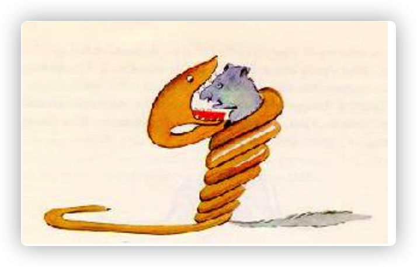
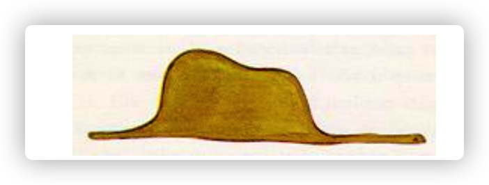
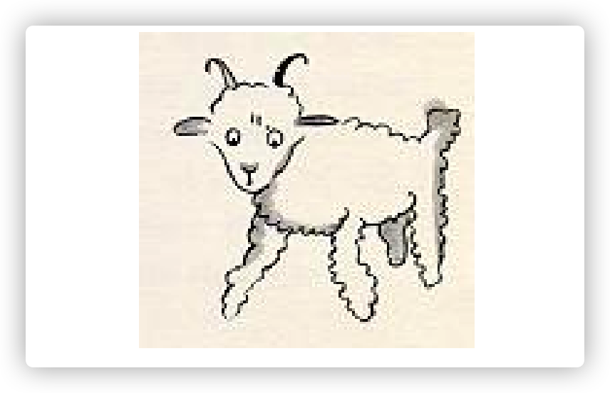
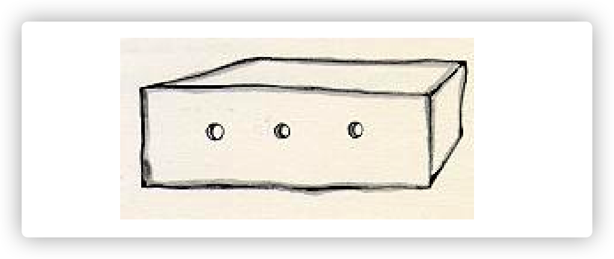

## 06-06

**1.2.1 Access Networks** 

​	Having considered the applications and end systems at the “edge of the network,” let’s next consider the access network—the network that physically connects an end system to the first router (also known as the “edge router”) on a path from the end system to any other distant end system. Figure 1.4 shows several types of access networks with thick, shaded lines and the settings (home, enterprise, and wide-area mobile wireless) in which they are used.

​	In **developed countries(发达国家)** as of 2014, more than 78 percent of the households have Internet access, with Korea, Netherlands, Finland, and Sweden leading the way with more than 80 percent of households having Internet access, almost all via a high-speed broadband connection [ITU 2015]. Given this widespread use of home access networks let’s begin our overview of access networks by considering how homes connect to the Internet.

​	Today, the two most **prevalent（流行的）** types of broadband residential access are digital subscriber line (DSL) and cable. A residence typically obtains DSL Internet access from the same local telephone company (telco) that provides its wired local phone access. Thus, when DSL is used, a customer’s telco is also its ISP. As shown in Figure 1.5, each customer’s DSL modem uses the existing telephone line (twistedpair copper wire, which we’ll discuss in Section 1.2.2) to exchange data with a digital subscriber line access multiplexer (DSLAM) located in the telco’s local central office (CO). The home’s DSL modem takes digital data and translates it to high-frequency tones for transmission over telephone wires to the CO; the analog signals from many such houses are translated back into digital format at the DSLAM.

​	The residential telephone line carries both data and traditional telephone signals **simultaneously（同时地）**, which are encoded at different frequencies:

- A high-speed downstream channel, in the 50 kHz to 1 MHz band 

- A medium-speed upstream channel, in the 4 kHz to 50 kHz band 

- An ordinary two-way telephone channel, in the 0 to 4 kHz band

​	This approach makes the single DSL link appear as if there were three separate links, so that a telephone call and an Internet connection can share the DSL link at the same time.(We’ll describe this technique of frequency-division multiplexing in Section 1.3.1.) 

​	On the customer side, a splitter separates the data and telephone signals arriving to the home and forwards the data signal to the DSL modem. On the telco side, in the CO, the DSLAM separates the data and phone signals and sends the data into the Internet. Hundreds or even thousands of households connect to a single DSLAM

​	The DSL standards define multiple transmission rates, including 12 Mbps downstream and 1.8 Mbps upstream [ITU 1999], and 55 Mbps downstream and 15 Mbps upstream [ITU 2006]. Because the downstream and upstream rates are different, the access is said to be **asymmetric（非对称）**. The actual downstream and upstream transmission rates achieved may be less than the rates noted above, as the DSL provider may **purposefully（目的性的）** limit a residential rate when **tiered（阶梯式）** service (different rates, available at different prices) are offered. The maximum rate is also limited by the distance between the home and the CO, the **gauge（测量仪器、估计）** of the twisted-pair line and the degree of **electrical interference（电气干扰）**. Engineers have **expressly（清楚地）** designed DSL for short distances between the home and the CO; generally, if the residence is not located within 5 to 10 miles of the CO, the residence must resort to an alternative form of Internet access.

​	While DSL makes use of the telco’s existing local telephone infrastructure, cable Internet access makes use of the cable television company’s existing cable television infrastructure. A residence obtains cable Internet access from the same company that provides its cable television. As illustrated in Figure 1.6, fiber optics connect the cable head end to neighborhood-level junctions, from which traditional coaxial cable is then used to reach individual houses and apartments. Each neighborhood junction typically supports 500 to 5,000 homes. Because both fiber and coaxial cable are employed in this system, it is often referred to as hybrid fiber coax (HFC).

​	Cable internet access requires special modems, called cable modems. As with a DSL modem, the cable modem is typically an external device and connects to the home PC through an Ethernet port. (We will discuss Ethernet in great detail in Chapter 6.) At the cable head end, the cable modem termination system (CMTS) serves a similar function as the DSL network’s DSLAM—turning the analog signal sent from the cable modems in many downstream homes back into digital format. Cable modems divide the HFC network into two channels, a downstream and an upstream channel. As with DSL, access is typically asymmetric, with the downstream channel typically allocated a higher transmission rate than the upstream channel. The DOCSIS 2.0 standard defines downstream rates up to 42.8 Mbps and upstream rates of up to 30.7 Mbps. As in the case of DSL networks, the maximum achievable rate may not be realized due to lower contracted data rates or media impairments.

​	One important characteristic of cable Internet access is that it is a **shared broadcast medium**. In particular, every packet sent by the head end travels downstream on every link to every home and every packet sent by a home travels on the upstream channel to the head end. For this reason, if several users are simultaneously downloading a video file on the downstream channel, the actual rate at which each user receives its video file will be significantly lower than the aggregate cable downstream rate. On the other hand, if there are only a few active users and they are all Web surfing, then each of the users may actually receive Web pages at the full cable downstream rate, because the users will rarely request a Web page at exactly the same time. Because the upstream channel is also shared, a **distributed multiple access protocol** is needed to **coordinate（协调）** transmissions and avoid collisions. (We’ll discuss this collision issue in some detail in Chapter 6.)

​	Although DSL and cable networks currently represent more than 85 percent of residential broadband access in the United States, an **up-and-coming（有前途）** technology that provides even higher speeds is fiber to the home (FTTH) [FTTH Council 2016]. As the name suggests, the FTTH concept is simple—provide an optical fiber path from the CO directly to the home. Many countries today—including the UAE, South Korea, Hong Kong, Japan, Singapore, Taiwan, Lithuania, and Sweden—now have household penetration rates exceeding 30% [FTTH Council 2016]. 

​	There are several competing technologies for optical distribution from the CO to the homes. The simplest optical distribution network is called direct fiber, with one fiber leaving the CO for each home. More commonly, each fiber leaving the central office is actually shared by many homes; it is not until the fiber gets relatively close to the homes that it is split into individual customer-specific fibers. There are two competing optical-distribution network architectures that perform this splitting: active optical networks (AONs) and passive optical networks (PONs). AON is essentially switched Ethernet, which is discussed in Chapter 6.

## **06-07:**

**Spring Framework Overview**

​	Spring makes it easy to create Java enterprise applications. It provides everything you need to embrace the Java language in an enterprise environment, with support for Groovy and Kotlin as alternative languages on the JVM, and with the **flexibility（灵活性）** to create many kinds of architectures depending on an application’s needs. As of Spring Framework 5.1, Spring requires JDK 8+ (Java SE 8+) and provides out-of-the-box support for JDK 11 LTS. Java SE 8 update 60 is suggested as the minimum patch release for Java 8, but it is generally recommended to use a recent patch release.

​	Spring supports a wide range of application scenarios. In a large enterprise, applications often exist for a long time and have to run on a JDK and application server whose **upgrade cycle（升级周期）** is beyond developer control. Others may run as a single jar with the server embedded, possibly in a cloud environment. Yet others may be **standalone（独立运行）** applications (such as batch or integration workloads) that do not need a server.

​	Spring is open source. It has a large and active community that provides continuous feedback based on a diverse range of real-world use cases. This has helped Spring to successfully evolve over a very long time.

**What We Mean by "Spring"**

​	The term "Spring" means different things in different contexts. It can be used to refer to the Spring Framework project itself, **which is where it all started（这是一切开始的地方）**. Over time, other Spring projects have been built on top of the Spring Framework. Most often, when people say "Spring", they mean the entire family of projects. This reference documentation focuses on the foundation: the Spring Framework itself.

​	The Spring Framework is divided into modules. Applications can choose which modules they need. At the heart are the modules of the **core container, including a configuration model and a dependency injection mechanism**. Beyond that, the Spring Framework provides foundational support for different application architectures, including messaging, transactional data and persistence, and web. It also includes the Servlet-based Spring MVC web framework and, in parallel, the Spring WebFlux reactive web framework.

​	A note about modules: Spring’s framework jars allow for deployment to JDK 9’s module path ("Jigsaw"). For use in Jigsaw-enabled applications, the Spring Framework 5 jars come with "Automatic-Module-Name" **manifest(表明)** entries which define stable language-level module names ("spring.core", "spring.context", etc.) independent from jar artifact names (the jars follow the same naming pattern with "-" instead of ".", e.g. "spring-core" and "spring-context"). Of course, Spring’s framework jars keep working fine on the classpath on both JDK 8 and 9+.

**2. History of Spring and the Spring Framework**

​	Spring came into being in 2003 as a response to the complexity of the early [J2EE](https://en.wikipedia.org/wiki/Java_Platform,_Enterprise_Edition) specifications. While some consider Java EE and Spring to be in competition, Spring is, in fact, **complementary（互补的）** to Java EE. The Spring programming model does not embrace the Java EE platform specification; rather, it integrates with carefully selected individual specifications from the EE umbrella:

- Servlet API ([JSR 340](https://jcp.org/en/jsr/detail?id=340))
- WebSocket API ([JSR 356](https://www.jcp.org/en/jsr/detail?id=356))
- Concurrency Utilities ([JSR 236](https://www.jcp.org/en/jsr/detail?id=236))
- JSON Binding API ([JSR 367](https://jcp.org/en/jsr/detail?id=367))
- Bean Validation ([JSR 303](https://jcp.org/en/jsr/detail?id=303))
- JPA ([JSR 338](https://jcp.org/en/jsr/detail?id=338))
- JMS ([JSR 914](https://jcp.org/en/jsr/detail?id=914))
- as well as JTA/JCA setups for transaction coordination, if necessary.

​	The Spring Framework also supports the Dependency Injection ([JSR 330](https://www.jcp.org/en/jsr/detail?id=330)) and Common Annotations ([JSR 250](https://jcp.org/en/jsr/detail?id=250)) specifications, which application developers may choose to use instead of the Spring-specific mechanisms provided by the Spring Framework.

​	As of Spring Framework 5.0, Spring requires the Java EE 7 level (e.g. Servlet 3.1+, JPA 2.1+) as a minimum - while at the same time providing out-of-the-box integration with newer APIs at the Java EE 8 level (e.g. Servlet 4.0, JSON Binding API) when encountered at runtime. This keeps Spring fully compatible with e.g. Tomcat 8 and 9, WebSphere 9, and JBoss EAP 7.

​	Over time, the role of Java EE in application development has evolved. In the early days of Java EE and Spring, applications were created to be deployed to an application server. Today, with the help of Spring Boot, applications are created in a **devops- and cloud-friendly way**, with the Servlet container embedded and **trivial（琐碎）** to change. As of Spring Framework 5, a WebFlux application does not even use the Servlet API directly and can run on servers (such as Netty) that are not Servlet containers.

​	Spring continues to innovate and to evolve. Beyond the Spring Framework, there are other projects, such as Spring Boot, Spring Security, Spring Data, Spring Cloud, Spring Batch, among others. It’s important to remember that each project has its own source code repository, issue tracker, and release **cadence（节拍、节律）**. See [spring.io/projects](https://spring.io/projects) for the complete list of Spring projects.

**3. Design Philosophy**

When you learn about a framework**, it’s important to know not only what it does but what principles it follows**. Here are the guiding principles of the Spring Framework:

- **Provide choice at every level.** Spring lets you **defer（延期）** design decisions as late as possible. For example, you can switch persistence providers through configuration without changing your code. The same is true for many other infrastructure concerns and integration with third-party APIs.

- **Accommodate（容纳） diverse perspectives**. Spring embraces flexibility and is not opinionated about how things should be done. It supports a wide range of application needs with different perspectives.

- **Maintain strong backward compatibility**. Spring’s evolution has been carefully managed to force few breaking changes between versions. Spring supports a carefully chosen range of JDK versions and third-party libraries to **facilitate（便利）** maintenance of applications and libraries that depend on Spring.

- **Care about API design.** The Spring team puts a lot of thought and time into making APIs that are **intuitive（直觉的、易懂的）** and that hold up across many versions and many years.

- **Set high standards for code quality.** The Spring Framework puts a strong emphasis on meaningful, current, and accurate javadoc. It is one of very few projects that can claim **clean code structure with no circular dependencies between packages.**

  

**4.Feedback and Contributions**

​	For how-to questions or **diagnosing（诊断）** or debugging issues, we suggest using Stack Overflow. Click [here](https://stackoverflow.com/questions/tagged/spring+or+spring-mvc+or+spring-aop+or+spring-jdbc+or+spring-r2dbc+or+spring-transactions+or+spring-annotations+or+spring-jms+or+spring-el+or+spring-test+or+spring+or+spring-remoting+or+spring-orm+or+spring-jmx+or+spring-cache+or+spring-webflux+or+spring-rsocket?tab=Newest) for a list of the suggested tags to use on Stack Overflow. If you’re fairly certain that there is a problem in the Spring Framework or would like to suggest a feature, please use the [GitHub Issues](https://github.com/spring-projects/spring-framework/issues).

​	If you have a solution in mind or a suggested fix, you can submit a pull request on [Github](https://github.com/spring-projects/spring-framework). However, please keep in mind that, for all but the most trivial issues, we expect a ticket to be filed in the issue tracker, where discussions take place and leave a record for future reference. For more details see the guidelines at the [CONTRIBUTING](https://github.com/spring-projects/spring-framework/tree/main/CONTRIBUTING.md), top-level project page.

**5.Getting Started**

​	If you are just getting started with Spring, you may want to begin using the Spring Framework by creating a [Spring Boot](https://projects.spring.io/spring-boot/)-based application. Spring Boot provides a quick (and opinionated) way to create a production-ready Spring-based application. It is based on the Spring Framework, **favors convention over configuration（约定优于配置）**, and is designed to get you up and running as quickly as possible.

​	You can use [start.spring.io](https://start.spring.io/) to generate a basic project or follow one of the ["Getting Started" guides](https://spring.io/guides), such as [Getting Started Building a RESTful Web Service](https://spring.io/guides/gs/rest-service/). As well as being easier to **digest（理解消化）**, these guides are very task focused, and most of them are based on Spring Boot. They also cover other projects from the Spring portfolio that you might want to consider when solving a particular problem.

## 06-08:

​	Once when I was six years old I saw a magnificent picture in a book, called True Stories from Nature, about the primeval forest. It was a picture of a **boa constrictor(蟒蛇)** in the act of swallowing an animal. Here is a copy of the drawing.

​	In the book it said: “Boa constrictors swallow their **prey（猎物）** whole, without chewing it. After that they are not able to move, and they sleep through the six months that they need for digestion.” 

​	I **pondered（沉思）** deeply, then, over the adventures of the jungle. And after some work with a colored pencil I succeeded in making my first drawing. My Drawing Number One. It looked like this:

​	I showed my **masterpiece（杰作）** to the grown-ups, and asked them whether the drawing frightened them.

​	But they answered: “Frighten? Why should any one be frightened by a hat?” 

​	My drawing was not a picture of a hat. It was a picture of a boa constrictor digesting an elephant. But since the grown-ups were not able to understand it, I made another drawing: I drew the inside of the boa constrictor, so that the grown-ups could see it clearly. **They always need to have things explained.** My Drawing Number Two looked like this:

​	The grown-ups’ response, this time, was to advise me to **lay aside** my drawings of boa constrictors, whether from the inside or the outside, and **devote（致力于）** myself instead to geography, history, arithmetic and grammar. That is why, at the age of six, I gave up what might have been a magnificent career as a painter. I had been **disheartened（沮丧）** by the failure of my Drawing Number One and my Drawing Number Two. Grown-ups never understand anything by themselves, and it is tiresome for children to be always and forever explaining things to them. So then I chose another profession, and learned to pilot airplanes. I have flown a little over all parts of the world; and it is true that geography has been very useful to me. At a **glance（）一眼** I can distinguish China from Arizona. If one gets lost in the night, such knowledge is valuable. 

​	In the course of this life I have had a great many encounters with a great many people who have been concerned with matters of consequence. I have lived a great deal among grown-ups. I have seen them **intimately（熟悉地）**, close at hand. And that hasn’t much improved my opinion of them. 

​	Whenever I met one of them who seemed to me at all clear-sighted, I tried the experiment of showing him my Drawing Number One, which I have always kept. I would try to find out, so, if this was a person of true understanding. But, whoever it was, he, or she, would always say: “That is a hat.” Then I would never talk to that person about boa constrictors, or primeval forests, or stars. I would bring myself down to his level. I would talk to him about bridge, and golf, and politics, and neckties. And the grown-up would be greatly pleased to have met such a sensible man.

## 06-09:

​	So I lived my life alone, without anyone that I could really talk to, until I had an accident with my plane in the Desert of Sahara, six years ago. Something was broken in my engine. And as I had with me neither a mechanic nor any **passengers(乘客)**, I set myself to attempt the difficult repairs all alone. It was a question of life or death for me: I had **scarcely（勉强，几乎不）** enough drinking water to last a week. The first night, then, I went to sleep on the sand, a thousand miles from any human habitation. I was more isolated than **a shipwrecked sailor on a raft in the middle of the ocean**. Thus you can imagine my amazement, at sunrise, when I was awakened by an odd little voice. It said: “If you please– draw me a sheep!” “What!” “Draw me a sheep!” I jumped to my feet, completely **thunderstruck（震惊）**. I blinked my eyes hard. I looked carefully all around me. And I saw a most extraordinary small person, who stood there examining me with great seriousness. Here you may see the best **portrait（肖像）** that, later, I was able to make of him. But my drawing is certainly very much less charming than its model.

​	That, however, is not my fault. The grown-ups discouraged me in my painter’s career when I was six years old, and I never learned to draw anything, except boas from the outside and boas from the inside.

​	Now I stared at this sudden **apparition（鬼怪）** with **my eyes fairly starting out of my head in astonishment**. Remember, I had crashed in the desert a thousand miles from any inhabited region. And yet my little man seemed neither to be **straying（走失、迷路）** uncertainly among the sands, nor to be **fainting（昏厥）** from **fatigue（疲乏）** or hunger or thirst or fear. Nothing about him gave any suggestion of a child lost in the middle of the desert, a thousand miles from any human habitation. When at last I was able to speak, I said to him: “But– what are you doing here?” And in answer he repeated, very slowly, as if he were speaking of a matter of great consequence: “If you please– draw me a sheep. . . ” When a mystery is too overpowering, one dare not disobey. Absurd as it might seem to me, a thousand miles from any human habitation and in danger of death, I took out of my pocket a sheet of paper and my fountain-pen. But then I remembered how my studies had been concentrated on geography, history, arithmetic, and grammar, and I told the little chap (a little crossly, too) that I did not know how to draw. He answered me: “That doesn’t matter. Draw me a sheep. . . ” But I had never drawn a sheep. So I drew for him one of the two pictures I had drawn so often. It was that of the boa constrictor from the outside. And I was astounded to hear the little fellow greet it with, “No, no, no! I do not want an elephant inside a boa constrictor. A boa constrictor is a very dangerous creature, and an elephant is very **cumbersome（笨重的）**. Where I live, everything is very small. What I need is a sheep. Draw me a sheep.” So then I made a drawing.

​	He looked at it carefully, then he said: “No. This sheep is already very **sickly（体弱）**. Make me another.” So I made another drawing. My friend smiled gently and **indulgently（放任地）**. “You see yourself,” he said, “that this is not a sheep. This is a **ram（公羊）**. It has **horns（喇叭）**.” So then I did my drawing over once more. But it was rejected too, just like the others. “This one is too old. I want a sheep that will live a long time.” By this time my patience was **exhausted（精疲力劲）**, because I was in a hurry to start taking my engine apart. So I tossed off this drawing. And I threw out an explanation with it. “This is only his box. The sheep you asked for is inside.” I was very surprised to see a light break over the face of my young judge: “That is exactly the way I wanted it! Do you think that this sheep will have to have a great deal of grass?” “Why?” “Because where I live everything is very small. . . ” “There will surely be enough grass for him,” I said. “It is a very small sheep that I have given you.” He **bent（弯曲）** his head over the drawing: “Not so small that– Look! He has gone to sleep. . . ” And that is how I made the acquaintance of the little prince.

## 06-10:

​	It took me a long time to learn where he came from. The little prince, who asked me so many questions, never seemed to hear the ones I asked him. It was from words dropped by **chance（偶然）** that, little by little, everything was revealed to me. The first time he saw my airplane, for instance (I shall not draw my airplane; that would be much too complicated for me), he asked me: “What is that object?” “That is not an object. It flies. It is an airplane. It is my airplane.” And I was proud to have him learn that I could fly. He cried out, then: “What! You dropped down from the sky?” “Yes,” I answered, modestly. “Oh! That is funny!” And the little prince broke into a lovely **peal（鸣响）** of laughter, which **irritated（恼火）** me very much. **I like my misfortunes to be taken seriously**. Then he added: “So you, too, come from the sky! Which is your planet?” At that moment I caught a gleam of light in the **impenetrable（不可理解）** mystery of his presence; and I demanded, abruptly: “Do you come from another planet?” But he did not reply. He tossed his head gently, without taking his eyes from my plane: “It is true that on that you can’t have come from very far away. . . ” And he sank into a **reverie（沉思）**, which lasted a long time. Then, taking my sheep out of his pocket, he buried himself in the **contemplation（沉思）** of his treasure. You can imagine how my curiosity was aroused by this half-confidence about the “other planets.” I made a great effort, therefore, to find out more on this subject. “My little man, where do you come from? What is this ‘where I live,’ of which you speak? Where do you want to take your sheep?” After a reflective silence he answered: “The thing that is so good about the box you have given me is that at night he can use it as his house.”

​	“That is so. And if you are good I will give you a string, too, so that you can tie him during the day, and a post to tie him to.” But the little prince seemed shocked by this offer: “Tie him! What a **queer（奇怪）** idea!” “But if you don’t tie him,” I said, “he will wander off somewhere, and get lost.” My friend broke into another peal of laughter: “But where do you think he would go?” “Anywhere. Straight ahead of him.” Then the little prince said, earnestly: “That doesn’t matter. Where I live, everything is so small!” And, with perhaps a hint of sadness, he added: “**Straight ahead of him, nobody can go very far**. . . ”

## 06-11:

​	I had thus learned a second fact of great importance: this was that the planet the little prince came from was scarcely any larger than a house! But that did not really surprise me much. I knew very well that in addition to the great planets– such as the Earth, Jupiter, Mars, Venus– to which we have given names, there are also hundreds of others, some of which are so small that one has a hard time seeing them through the telescope. When an astronomer discovers one of these he does not give it a name, but only a number. He might call it, for example, “**Asteroid(小型星)** 325.” I have serious reason to believe that the planet from which the little prince came is the asteroid known as B-612. This asteroid has only once been seen through the telescope. That was by a Turkish astronomer, in 1909.

​	On making his discovery, the astronomer had **presented(展示、提交)** it to the International Astronomical Congress, in a great demonstration. But he was in Turkish **costume(服装)**, and so nobody would believe what he said. Grown-ups are like that. . . Fortunately, however, for the reputation of Asteroid B-612, a Turkish **dictator(独裁者)** made a law that his subjects, **under pain of death**, should change to European costume. So in 1920 the astronomer gave his demonstration all over again, dressed with impressive style and elegance. And this time everybody accepted his report.

​	If I have told you these details about the asteroid, and made a note of its number for you, it is on account of the grown-ups and their ways. When you tell them that you have made a new friend, they never ask you any questions about essential matters. They never say to you, “What does his voice sound like? What games does he love best? Does he collect butterflies?” Instead, they demand: “How old is he? How many brothers has he? How much does he weigh? How much money does his father make?” Only from these figures do they think they have learned anything about him. If you were to say to the grown-ups: “I saw a beautiful house made of **rosy(玫瑰色)** brick, with **geraniums（天竺葵）** in the windows and doves on the roof,” they would not be able to get any idea of that house at all. You would have to say to them: “I saw a house that cost $20,000.” Then they would exclaim: “Oh, what a pretty house that is!”

​	Just so, you might say to them: “The proof that the little prince existed is that he was charming, that he laughed, and that he was looking for a sheep. If anybody wants a sheep, that is a proof that he exists.” And what good would it do to tell them that? They would shrug their shoulders, and treat you like a child. But if you said to them: “The planet he came from is Asteroid B-612,” then they would be convinced, and leave you in peace from their questions. They are like that. One must not hold it against them. Children should always show great **forbearance（忍耐、宽容）** toward grown-up people. **But certainly, for us who understand life, figures are a matter of indifference.** I should have liked to begin this story in the fashion of the **fairy-tales（童话）**. I should have like to say: “Once upon a time there was a little prince who lived on a planet that was scarcely any bigger than himself, and who had need of a sheep. . . ” To those who understand life, that would have given a much greater air of truth to my story.

​	For I do not want any one to read my book carelessly. I have suffered too much **grief（悲伤）** in setting down these memories. Six years have already passed since my friend went away from me, with his sheep. If I try to describe him here, it is to make sure that I shall not forget him. To forget a friend is sad. Not every one has had a friend. And if I forget him, I may become like the grown-ups who are no longer interested in anything but figures. . .

​	It is for that purpose, again, that I have bought a box of paints and some pencils. It is hard to take up drawing again at my age, when I have never made any pictures except those of the boa constrictor from the outside and the boa constrictor from the inside, since I was six. I shall certainly try to make my 13 portraits as true to life as possible. But I am not at all sure of success. One drawing goes along all right, and another has no **resemblance（相似）** to its subject. I make some errors, too, in the little prince’s height: in one place he is too tall and in another too short. And I feel some doubts about the color of his costume. So I **fumble（笨手笨脚）** along as best I can, now good, now bad, and I hope generally **fair-to-middling（过得去）**.In certain more important details I shall make mistakes, also. But that is something that will not be my fault. My friend never explained anything to me. He thought, perhaps, that I was like himself. But I, alas, do not know how to see sheep through the walls of boxes. Perhaps I am a little like the grown-ups. I have had to grow old.

